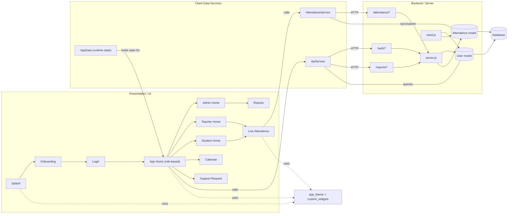

# User Flow Diagram

Below is the user-flow (presentation → services → backend) for the current AUTODEMY project.

Notes
- UI screens in `lib/presentation/screens/*` drive user actions (auth, dashboard, live attendance, reports, calendar, support).
- `lib/data/services/*` (ApiService, AttendanceService) encapsulate HTTP calls to `backend/server.js` endpoints.
- Backend handlers use `backend/models/User.js` and `backend/models/Attendance.js` to persist to the DB; `seed.js` seeds initial data.
- `lib/data/app_data.dart` keeps runtime app state; `lib/core/theme/app_theme.dart` and `lib/presentation/widgets/custom_widgets.dart` provide styling/components.

File: [docs/user_flow.md](docs/user_flow.md)
